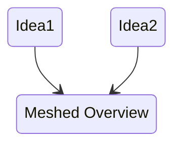

This 'manifesto' is an attempt to provide an balanced political approach to issues, however some would argue the idea of looking for change and improvement for society as a whole is inherently political. 

In relation to this, our argument is that the two arms of political discourse (left vs right) is a distraction to actual progress. To place our approach on an axes is instead of looking left and right, to be looking forwards to creating a better shared future, within this attempting to approach issues for the long-term not just the short-term.

Perhaps this could be described as **pragmatic progressivism**, though getting bogged down in political definitions is counter to the mission of change.
## Some Plans For The Future
1. Approach each issue from multiple perspectives (this likely requires contributions of different authors). An attempt then to try to peer-review these and try to find similarities perhaps in the intended outcome, to try to break down the barriers and attempt to lead to a shared perspective.

2. There needs a way to categorise issues, and allow some of peer-review. Tagging may be along the way to a solution to categorising. Perhaps, general thoughts could be attached to a post through a new page with a unique page title, and then cross-linked at the bottom. There would obviously need to be a way to simplify or combine these comments, to avoid unnecessary bloat.
## General Philosophy
1. Simple and readable is better but not to the detriment of an idea - if an idea can be written in less words, without losing any of the essence it should be. 
2. Evidenced ideas are better. This can be your own data collection and provision, in which case the tools/data should be open access. It can also mean collecting research sources, in which case more (but **relevant**) sources are better. These can be attached as footnotes.[^1], or inline depending on individual preference.

[^1]: This is an example of a reference
## Tags
Below is an initial list of tags in use across the pages, more may be added at any point. Ideally the list of tags should be kept to a minimum, and the aim should be to ensure cross-linking so following a train of thought seem easy and logical without too much searching.

| Tag               | Description                                                                                                                         |
| ----------------- | ----------------------------------------------------------------------------------------------------------------------------------- |
| [[Background]]    | A page to describe the background concepts, should describe nothing innovative, but useful to be referenced in a [[Proposal]]       |
| [[Meta-Analysis]] | A sub-tag for [[Background]] to describe pages where an overview is given of findings with reference to multiple different studies. |
| [[Proposal]]      | A page that describes a policy concept.                                                                                             |
| [[WIP]]           | A work in progress.                                                                                                              |

## Discussion
Discussion will likely be held across a number of sites until the best method for handling them makes itself known. GitHub issues provides one option, while Reddit another. Finally there is a possibly that certain conversations can occur in a markdown format and therefore can be stored as an archive.